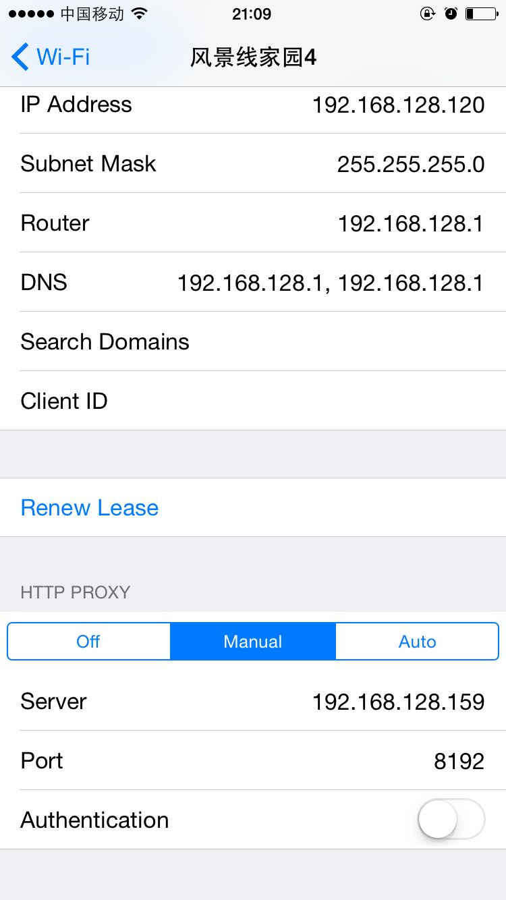
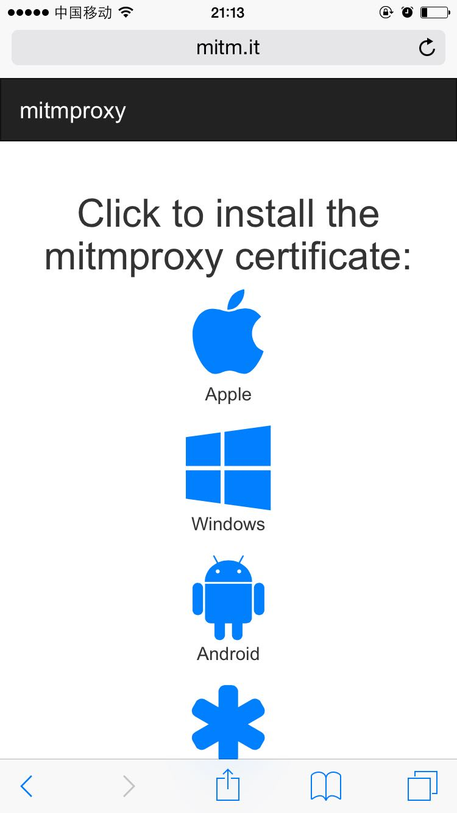
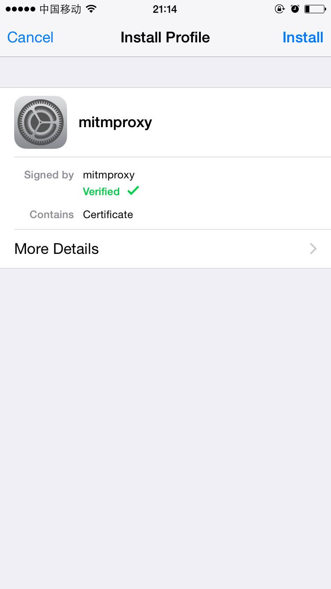

# tools
小工具

**web_scanner.py**

> 这个脚本是用字典跑网站路由的, 目的是发现一些曾经爆出过漏洞的隐藏链接, 比如后台登陆入口, 备份的配置文件等;

**web_runtime.py**

> 这个脚本运行后, 可以在浏览器页面上运行python代码片段;

**mail_client.py**

> 这个脚本是用tkinter模块写的简易邮件发送客户端;

**restart_windows.py**

> 预约一个windows定时关机任务, 取消定时关机任务

**douban_comment.ipynb**

> 抓取豆瓣电影短评, 结巴分词, 生成词云. 需要在jupyter notebook环境下运行. 另外, 由于词云需要字体文件, 可以去字体网站下载, 或者用系统自带的字体.

**jandan_pic.py**

> 这个脚本下载煎蛋网的图片版块(妹子图/无聊图/画廊/鱼塘)等贴图版块的图片, 低调使用, 不要把煎蛋玩坏了.

**qt5_stock.py**

> 这个脚本生成悬浮窗看股票.

**wechat_parser.py**

> 这个脚本需要配合`mitmproxy`来使用, 先`pip install mitmproxy`安装, 然后运行`mitmdump -p 8192 -s wechat_parser.py`, 保证你的手机和PC在同一局域网, 打开手机wifi设置, 设置代理. 其中Server为你的PC的IP, Port为8192.

然后打开浏览器, 访问`http://mitm.it`, 点击安装对应的证书.

